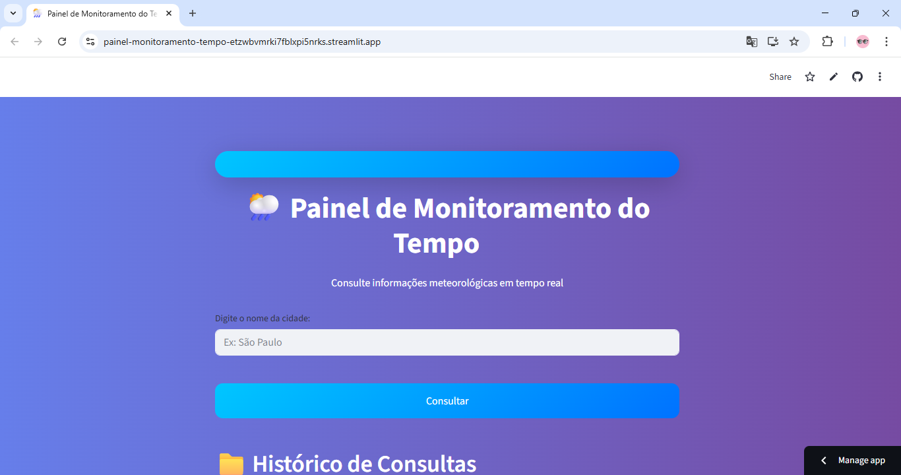
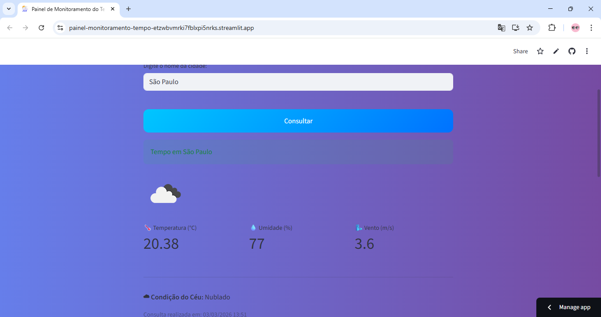
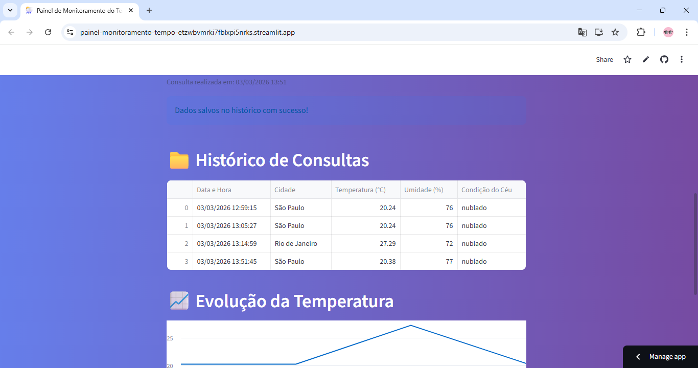
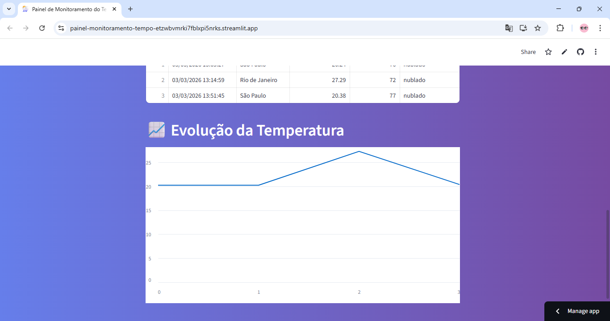

# 🌦️ Painel de Monitoramento do Tempo


---

## 📖 Sobre o Projeto

Aplicação desenvolvida em **Python** para consulta de dados meteorológicos em tempo real utilizando API externa.

O projeto evoluiu de uma aplicação **desktop com Tkinter** para uma aplicação **web interativa com Streamlit**, publicada na nuvem ☁️.

---

## 🚀 Evolução do Projeto

- 🖥️ **v1.0** — Interface Desktop com Tkinter  
- 🌐 **v2.0** — Interface Web com Streamlit  
- 📊 **v2.1** — Histórico de consultas + gráfico + deploy em cloud  

Essa evolução demonstra adaptação de arquitetura e modernização da interface.

---

## ⚙️ Funcionalidades

🔍 **Busca de clima por qualquer cidade**

🌡️ **Exibição de:**
- Temperatura (°C)
- Umidade (%)
- Velocidade do vento
- Condição do céu com ícone dinâmico

📁 **Histórico automático de consultas em Excel**

📈 **Gráfico de evolução da temperatura**

🕒 **Registro de data e hora da consulta**

🔐 **Proteção da API Key com variáveis de ambiente (.env)**

☁️ **Deploy na Streamlit Cloud**

---

## 🛠️ Tecnologias Utilizadas

- 🐍 Python 3
- 🌐 Streamlit
- 🔗 Requests
- 📊 Pandas
- 📁 OpenPyXL
- ☁️ OpenWeatherMap API
- 🔐 Python-dotenv

---

## 🧩 Arquitetura do Projeto

Estrutura modular com separação de responsabilidades:

```bash
app/
│
├── services/
│ ├── clima_service.py # Consumo da API
│ └── excel_service.py # Persistência em Excel
│
└── app_streamlit.py # Interface Web
```

✔ Separação entre camada de serviço e interface  
✔ Organização modular  
✔ Tratamento de erros  
✔ Estrutura pronta para futura migração para banco de dados  

---

## ☁️ Deploy

Aplicação publicada na **Streamlit Cloud**:

🔗 **Acesse aqui:** https://painel-monitoramento-tempo-etzwbvmrki7fblxpi5nrks.streamlit.app/

---

## ▶️ Como Executar Localmente

### 1️⃣ Clone o repositório

```bash
git clone https://github.com/Ingridxisto/painel-monitoramento-tempo.git
cd painel-monitoramento-tempo
```

### 2️⃣ Instale as dependências
```bash
pip install -r requirements.txt
```

### 3️⃣ Configure a API Key

Crie um arquivo .env na raiz do projeto:

```bash
OPENWEATHER_API_KEY=SUA_CHAVE_AQUI
```

⚠️ O arquivo .env não é versionado por segurança.

### 4️⃣ Execute a aplicação
```bash
streamlit run app_streamlit.py
```

---

## 🖼️ Interface da Aplicação

### 🌐 Versão Web - Streamlit

<p align="center">
  
</p>

<p align="center">
  
</p>

<p align="center">
  
</p>

<p align="center">
  
</p>

---

## 📚 Aprendizados

✔ Consumo de APIs REST

✔ Deploy de aplicação Python

✔ Persistência de dados em Excel

✔ Tratamento de erros em ambiente cloud

✔ Organização e modularização de código

✔ Separação entre backend e interface

✔ Proteção de credenciais sensíveis

---

## 👩‍💻 Autora

**Ingrid Xisto**

Estudante de Análise e Desenvolvimento de Sistemas

Foco em Python, Automação, APIs e Inteligência Artificial

🔗 GitHub: https://github.com/Ingridxisto

🔗 LinkedIn: https://www.linkedin.com/in/ingridxisto/


⭐ Se você gostou do projeto, deixe uma estrela no repositório!
